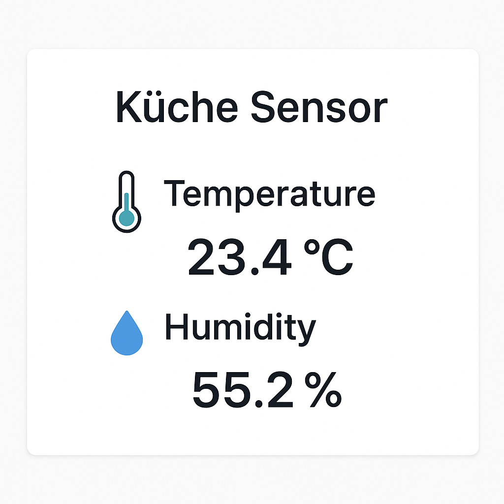

# 🌡️ ESP8266 DHT11 Webserver + Microsoft Flow Integration

This is an Arduino project that reads temperature and humidity data from a **DHT11 sensor**, displays it on a local web page, and **sends the data to a Microsoft Logic Flow (webhook)** when certain conditions are met.

## 📦 Features

- Live temperature & humidity display in the browser
- ESP8266 AsyncWebServer for super-fast web interface
- Auto HTTP POST to Microsoft Flow / Power Automate when temperature > 30°C
- Low power consumption & autonomous operation

## 🧠 Requirements

- NodeMCU ESP8266 (e.g., LOLIN D1 Mini or similar)
- DHT11 (or DHT22 – just change `#define DHTTYPE`)
- Jumper wires
- Micro-USB cable

## 🔧 Arduino IDE Setup

1. **Install ESP8266 board:**
   - Go to File > Preferences > Additional Board URLs:
     ```
     http://arduino.esp8266.com/stable/package_esp8266com_index.json
     ```
   - Then go to Tools > Board > Board Manager > search for "ESP8266" and install.

2. **Install the following libraries:**
   - `ESPAsyncWebServer`
   - `ESPAsyncTCP`
   - `DHT sensor library` by Adafruit
   - `Adafruit Unified Sensor`
   - `ESP8266WiFi`, `ESP8266HTTPClient`, `WiFiClientSecureBearSSL` (usually preinstalled)

## ⚙️ Wiring

| DHT11 Pin | NodeMCU (ESP8266) |
|----------:|------------------:|
| VCC       | 3.3V              |
| GND       | GND               |
| DATA      | D1 (GPIO5)        |

## 🛠️ Code Setup

1. Open the sketch in the Arduino IDE.
2. Replace the placeholders with your actual WiFi and Flow details:

```cpp
const char* ssid = "your SSID";
const char* password = "your Password";
String FlowUrl = "https://<your_logic_app_url>";
```

3. Under *Tools > Board*, select your ESP8266 model (e.g., "NodeMCU 1.0").
4. Upload the sketch and start.

## 🌍 Webserver



After connecting to WiFi, you'll see the local IP address in the **Serial Monitor** (115200 baud).  
Open that IP in your browser to view a live web page with temperature and humidity values.

## 🔄 Webhook Trigger (Microsoft Flow)

When the temperature exceeds **30°C**, a JSON request is sent like this:

```json
{
  "temperature": 32.5
}
```

You need to set your Flow to use a manual HTTP trigger and paste its URL + token into `FlowUrl`.

## 🧠 Tip

If you use a `DHT22` or `DHT21` sensor, just change this line:

```cpp
#define DHTTYPE    DHT11
// to for example:
// #define DHTTYPE    DHT22
```

## 💬 Contact

If you have questions, feel free to slide into the DMs – or tweak the code your way 🛠️🔥
